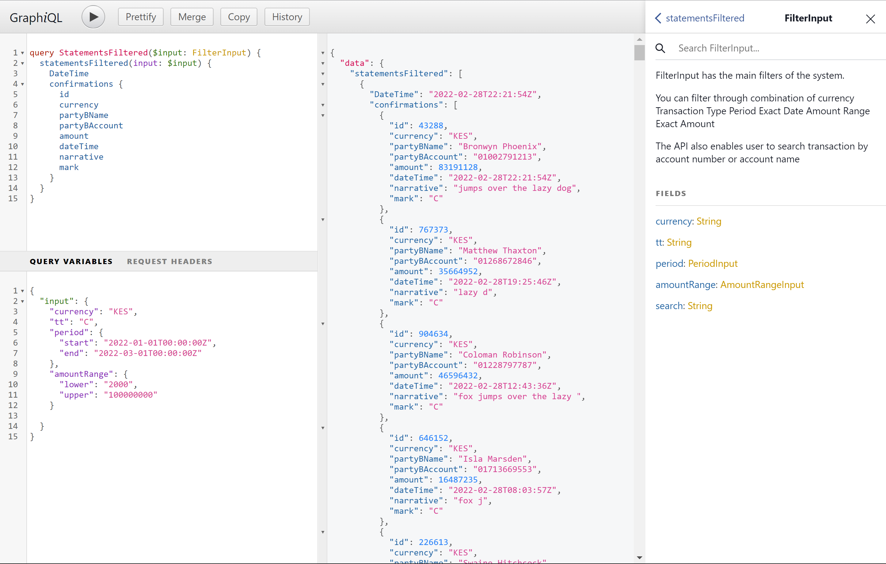

# MT940 Server

The API Playground can be accessed at [https://mt940-server-s47opgtmgq-uc.a.run.app](https://mt940-server-s47opgtmgq-uc.a.run.app)  

Solution  submission for the equity hackathon.  
To access full information about the challenge visit [https://github.com/riviatechs/equity-report](https://github.com/riviatechs/equity-report)  

## Database Connection

To connect to a remote database e.g GCP SQL Postgres, you can setup the cloud sql proxy as follow

`cloud_sql_proxy.exe -instances='rutela:us-central1:riaviatech'=tcp:127.0.0.1:8484`
